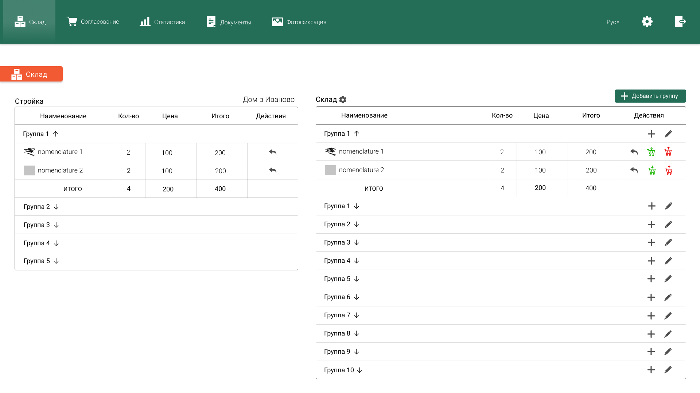

# Знайте точно, сколько будет стоить стройка
### Учёт материалов, инструментов и рабочего времени на строительном объекте
#

## **_Согласование_**
##### В любое время и в любом месте осуществляйте контроль за процессом строительства или ремонта с помощью ноутбука или мобильного телефона

#

## **_Заказы и склад_**
##### Модуль “Заказы и Склад” позволяет ответственным сотрудникам осуществлять заказ материалов на стройку непосредственно из мобильного приложения. 3 нажатия пальцем и материалы уже заказаны! Курьер из магазина или Ваш сотрудник может осуществлять доставку заказанных материалов, а руководитель отслеживать эти движения.

#

## **_Документы_**
##### Все документы, сметы, чеки и планы всегда под рукой с помощью модуля “Документы”. Вы всегда сможете сохранить нужный Вам документ и поделится им с клиентом, архитектором или стройфирмой.

#

## **_Фотофиксации_**
##### Все изменения фиксируйте фотографиями 
